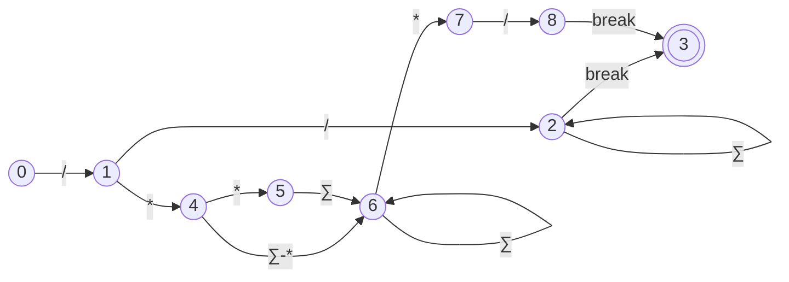
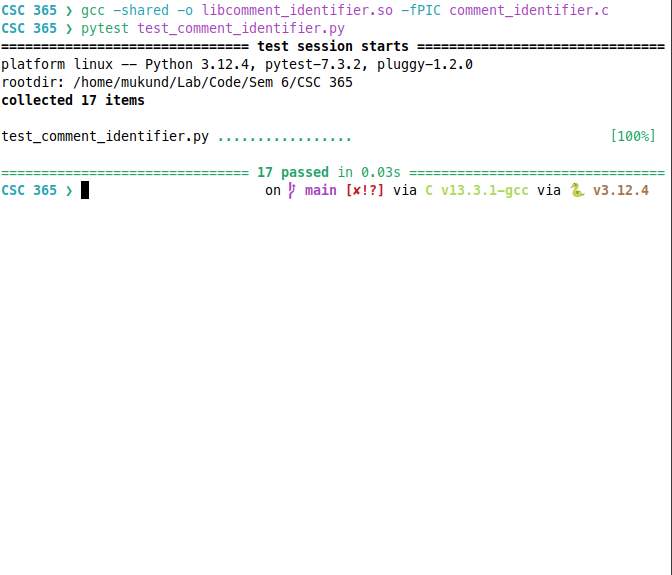
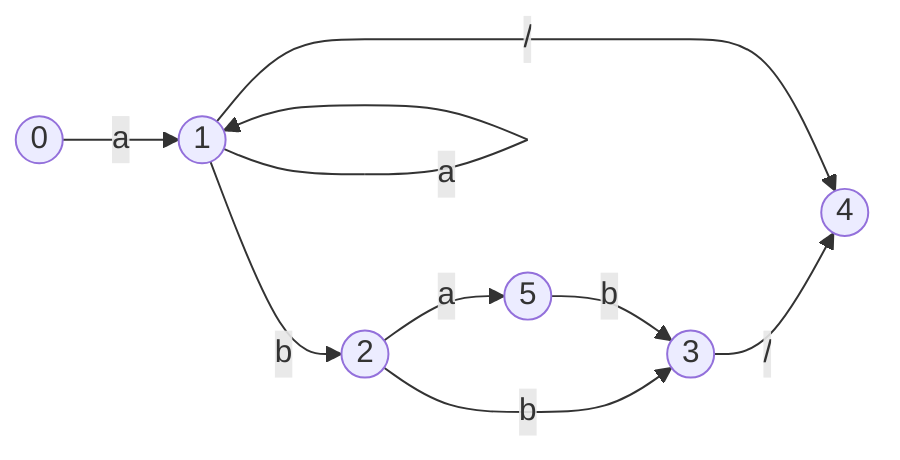
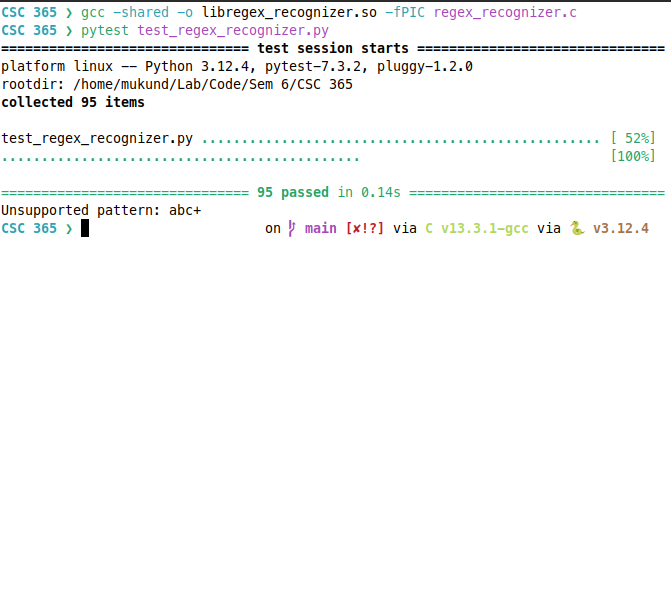
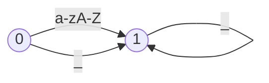
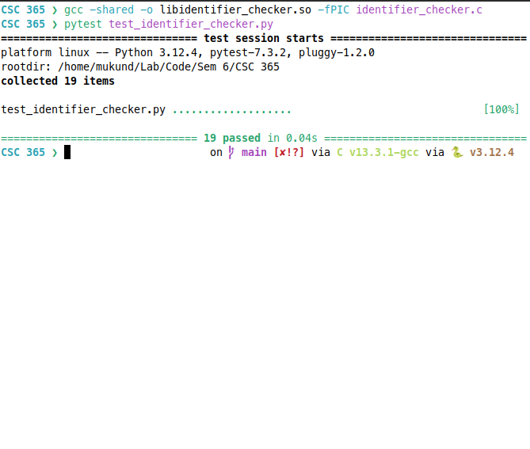
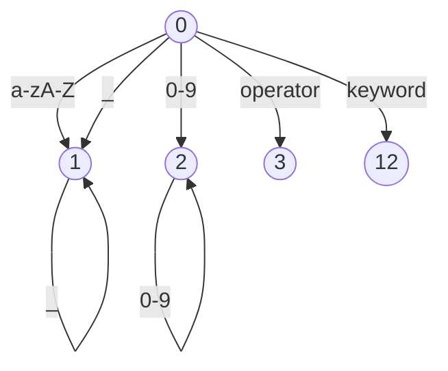
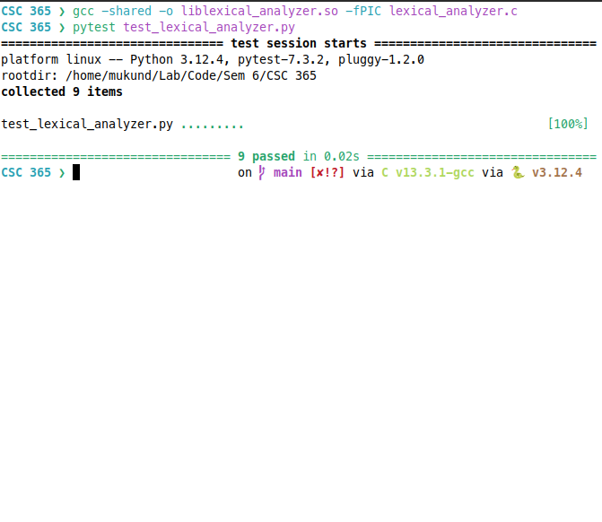
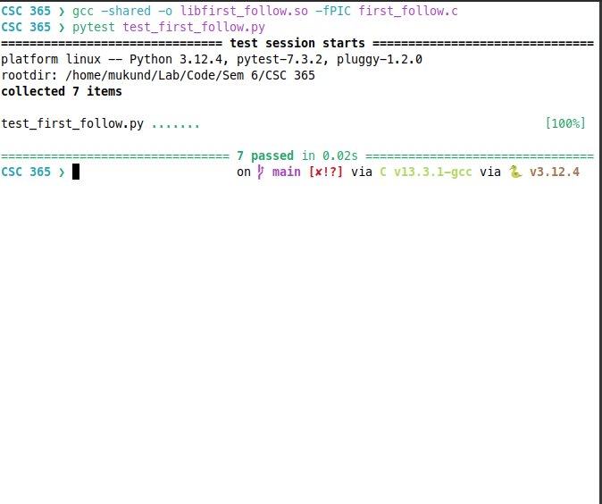

# LAB 1: COMMENTS

## OBJECTIVES

- Understand the purpose and significance of comments in programming.
- Learn the different types of comments (single-line, multi-line, documentation).
- Implement comment tokens in a lexer.
- Develop a C program to determine whether a given string is a valid comment.

## THEORETICAL BACKGROUND

Comments are a crucial component of any programming language. They serve to clarify the code for the reader, enhance readability, and facilitate maintenance. Comments are ignored by the compiler or interpreter, meaning they do not affect the execution of the program. There are three primary types of comments:

1. **Single-line comments**: These comments occupy a single line and typically begin with a specific symbol or sequence of symbols (e.g., `//`, `#`). Everything following this symbol on that line is treated as a comment.

2. **Multi-line comments**: These comments can span multiple lines and are usually enclosed between a pair of delimiters (e.g., `/* ... */`). Everything between these delimiters is considered a comment.

3. **Documentation comments**: These comments are specifically used for generating documentation. They often have a distinct syntax (e.g., starting with `/**` and ending with `*/`) and are used to describe the code in a way that can be extracted into documentation.

### Example Syntax for Various Languages

- **C/C++/Java**:
  - Single-line: `// This is a comment`
  - Multi-line: `/* This is a multi-line comment */`
  - Documentation: `/** This is a documentation comment */`

- **Python**:
  - Single-line: `# This is a comment`
  - Multi-line: `''' This is a multi-line comment '''` or `""" This is a multi-line comment """`

- **JavaScript**:
  - Single-line: `// This is a comment`
  - Multi-line: `/* This is a multi-line comment */`
  - Documentation: `/** This is a documentation comment */`

## IMPLEMENTATION

To implement the recognition of comments in a lexer, we will use the following approach:

1. **Single-line comments**: Detect the presence of the single-line comment symbol and consider all subsequent characters on that line as part of the comment.
2. **Multi-line comments**: Detect the start delimiter and end delimiter, considering all characters between them as part of the comment.
3. **Documentation comments**: Detect the start and end delimiters specific to documentation comments, considering all characters between them as part of the comment.

### State Diagram



## OUTPUTS



## CONCLUSION

In this lab, we explored the importance of comments in programming and the different types of comments. We also implemented comment tokens in a lexer and developed a C program to test whether a given string is a valid comment. This exercise emphasized the significance of comments in making code more understandable and maintainable.

# LAB 2: REGULAR EXPRESSIONS

## OBJECTIVES

- Understand the concept of regular expressions and their applications in programming.
- Learn about the syntax and metacharacters used in regular expressions.
- Implement regular expressions in a lexer to recognize specific patterns in the input.
- Develop a C program to recognize under the patterns `a*`, `a*b+`, and `abb`

## THEORETICAL BACKGROUND

Regular expressions are sequences of characters that define a search pattern. They are used for pattern matching within strings and are widely employed in text processing, search algorithms, and lexical analysis. Regular expressions consist of literal characters and metacharacters that represent specific patterns. Some common metacharacters include:

- `.`: Matches any single character.
- `*`: Matches zero or more occurrences of the preceding character.
- `+`: Matches one or more occurrences of the preceding character.

### Example Regular Expressions

- `a*`: Matches zero or more occurrences of the character `a`.
- `a*b+`: Matches zero or more occurrences of `a` followed by one or more occurrences of `b`.
- `abb`: Matches the exact sequence `abb`.

## IMPLEMENTATION

To implement regular expressions in a lexer, we will use the following approach:

1. **Pattern Matching**: Define regular expressions for the patterns `a*`, `a*b+`, and `abb`.
2. **State Diagram**: Create a state diagram to represent the transitions based on the regular expressions.
3. **Lexer Implementation**: Implement the lexer to recognize the specified patterns using regular expressions.

### State Diagram



## OUTPUTS



## CONCLUSION

In this lab, we explored the concept of regular expressions and their applications in programming. We implemented regular expressions in a lexer to recognize specific patterns in the input. By developing a C program to recognize the patterns `a*`, `a*b+`, and `abb`, we gained a better understanding of how regular expressions can be used for pattern matching and text processing.

# LAB 3: IDENTIFIER

## OBJECTIVES

- Understand the concept of identifiers in programming languages.
- Learn about the rules and conventions for naming identifiers.
- Implement identifier recognition in a lexer.
- Develop a C program to determine whether a given string is a valid identifier.

## THEORETICAL BACKGROUND

Identifiers are names given to various program elements such as variables, functions, classes, and objects. They play a crucial role in programming as they provide a way to refer to these elements within the code. Identifiers must adhere to specific rules and conventions, which may vary depending on the programming language. Some common rules for naming identifiers include:

- Must start with a letter (uppercase or lowercase) or an underscore `_`.
- Can contain letters, digits, and underscores.

### Example Identifier Rules

- Valid identifiers: `variable`, `_count`, `MAX_SIZE`, `myFunction123`

- Invalid identifiers: `123variable`, `my-variable`, `my identifier`

## IMPLEMENTATION

To implement identifier recognition in a lexer, we will use the following approach:

1. **Identifier Rules**: Define the rules for valid identifiers based on the theoretical background.
2. **State Diagram**: Create a state diagram to represent the transitions for recognizing identifiers.
3. **Lexer Implementation**: Implement the lexer to recognize valid identifiers based on the defined rules.

### State Diagram



## OUTPUTS



## CONCLUSION

In this lab, we explored the concept of identifiers in programming languages and the rules for naming them. By implementing identifier recognition in a lexer and developing a C program to determine whether a given string is a valid identifier, we gained a better understanding of how identifiers are used and validated in programming.

# LAB 4: LEXICAL ANALYZER

## OBJECTIVES

- Understand the role and importance of lexical analysis in the compilation process.
- Learn about the components of a lexical analyzer.
- Implement a simple lexical analyzer to recognize tokens in a given input.
- Develop a C program to perform lexical analysis on a sample input.

## THEORETICAL BACKGROUND

Lexical analysis is the first phase of the compilation process, where the input source code is converted into a sequence of tokens for further processing. A lexical analyzer, also known as a lexer, reads the input character stream and generates tokens based on the defined rules. The tokens represent the smallest meaningful units of the source code, such as keywords, identifiers, constants, and operators.

### Components of a Lexical Analyzer

1. **Input Buffer**: Stores the input character stream to be processed.

2. **Tokenization**: Identifies and categorizes the input characters into tokens based on predefined rules.

3. **Token Output**: Generates a sequence of tokens as output for further processing by the parser.

## IMPLEMENTATION

To implement a simple lexical analyzer, we will follow these steps:

1. **Token Definitions**: Define the tokens to be recognized by the lexer (e.g., keywords, identifiers, constants).

2. **State Diagram**: Create a state diagram to represent the transitions for recognizing tokens.

3. **Lexer Implementation**: Implement the lexer to recognize tokens based on the defined rules.

### State Diagram



## OUTPUTS



## CONCLUSION

In this lab, we explored the role of lexical analysis in the compilation process and the components of a lexical analyzer. By implementing a simple lexical analyzer to recognize tokens in a given input and developing a C program to perform lexical analysis, we gained a better understanding of how lexers process source code and generate tokens for further processing.

# LAB 5: FIRST & FOLLOW OF GRAMMAR

## OBJECTIVES

- Understand the concepts of First and Follow sets in the context of formal grammars.
- Learn how First and Follow sets are used in parsing algorithms.
- Calculate the First and Follow sets for a given grammar.
- Develop a C program to compute the First and Follow sets of a grammar.

## THEORETICAL BACKGROUND

In the context of formal grammars, the First set of a non-terminal symbol is the set of terminal symbols that can appear as the first symbol of a string derived from that non-terminal. The Follow set of a non-terminal symbol is the set of terminal symbols that can appear immediately to the right of that non-terminal in some derivation.

### Steps to Calculate First and Follow Sets

1. **First Set Calculation**:
   - Initialize the First set of each non-terminal to an empty set.
   - For each production rule, add the First set of the first symbol to the First set of the non-terminal.
   - Repeat the process until no new symbols can be added to the First set.

2. **Follow Set Calculation**:
    - Initialize the Follow set of the start symbol to contain the end-of-input marker `$`.
    - For each production rule, update the Follow set based on the position of the non-terminal in the rule.
    - Repeat the process until no new symbols can be added to the Follow set.

## IMPLEMENTATION

To calculate the First and Follow sets of a grammar, we will follow these steps:

1. **Grammar Definition**: Define the grammar for which the First and Follow sets will be calculated.

2. **First Set Calculation**: Implement a function to compute the First set of each non-terminal symbol in the grammar.

3. **Follow Set Calculation**: Implement a function to compute the Follow set of each non-terminal symbol in the grammar.

## OUTPUTS



## CONCLUSION

In this lab, we explored the concepts of First and Follow sets in the context of formal grammars and parsing algorithms. By calculating the First and Follow sets for a given grammar and developing a C program to compute these sets, we gained a better understanding of how these sets are used in parsing and syntax analysis.

# LAB 6: LL(1) PARSER & PARSING TABLE

## OBJECTIVES

- Understand the concept of LL(1) parsing and LL(1) grammars.
- Learn how LL(1) parsers use parsing tables to parse input strings.
- Construct the parsing table for an LL(1) grammar.
- Develop a C program to implement an LL(1) parser using the parsing table.

## THEORETICAL BACKGROUND

LL(1) parsing is a top-down parsing technique that uses a left-to-right scan of the input string and leftmost derivation to construct a parse tree. An LL(1) parser is a type of predictive parser that uses a parsing table to determine the production rule to apply based on the current input symbol and the top of the parsing stack.

### Steps to Construct an LL(1) Parsing Table

1. **First and Follow Sets**: Calculate the First and Follow sets of the non-terminal symbols in the grammar.

2. **Parsing Table Construction**:
   - For each production rule `A -> α`, where `A` is a non-terminal and `α` is a sequence of symbols:
     - For each terminal symbol `a` in the First set of `α`, add `A -> α` to the table entry `(A, a)`.
     - If `ε` is in the First set of `α`, add `A -> α` to the table entry `(A, b)` for each terminal symbol `b` in the Follow set of `A`.
     - If `ε` is in the First set of `α` and `$` is in the Follow set of `A`, add `A -> α` to the table entry `(A, $)`.
    - If there is a conflict in the table entries, the grammar is not LL(1).

## IMPLEMENTATION

To implement an LL(1) parser and construct the parsing table, we will follow these steps:

1. **Grammar Definition**: Define the LL(1) grammar for which the parsing table will be constructed.

2. **First and Follow Sets**: Calculate the First and Follow sets of the non-terminal symbols in the grammar.

3. **Parsing Table Construction**: Implement a function to construct the LL(1) parsing table based on the First and Follow sets.

4. **LL(1) Parser Implementation**: Develop a C program to implement an LL(1) parser using the constructed parsing table.

## OUTPUTS

```shell
gcc -c -fPIC first_follow.c -o first_follow.o
gcc -c -fPIC ll1_parser.c -o ll1_parser.o
gcc -shared -o libll1_parser.so first_follow.o ll1_parser.o

pytest test_ll1_parser.py
```

## CONCLUSION

In this lab, we explored the concept of LL(1) parsing and LL(1) grammars, as well as the construction of parsing tables for LL(1) parsers. By constructing the parsing table for an LL(1) grammar and developing a C program to implement an LL(1) parser, we gained a better understanding of how LL(1) parsers use parsing tables to parse input strings.

# LAB 7: SHIFT-REDUCE PARSER

## OBJECTIVES

- Understand the concept of shift-reduce parsing and shift-reduce parsers.
- Learn how shift-reduce parsers use a stack to parse input strings.
- Implement a shift-reduce parser to parse input strings based on a given grammar.

## THEORETICAL BACKGROUND

Shift-reduce parsing is a bottom-up parsing technique that uses a stack to parse input strings by shifting input symbols onto the stack and reducing them based on the production rules of the grammar. A shift-reduce parser performs two main operations: shifting (pushing input symbols onto the stack) and reducing (applying production rules to reduce the stack contents).

### Shift-Reduce Parser Algorithm

1. **Initialization**: Initialize the stack with the start symbol of the grammar and the input string.

2. **Parsing Loop**:
   - If the top of the stack and the current input symbol match, shift the input symbol onto the stack.
   - If the top of the stack matches the right-hand side of a production rule, reduce the stack based on that rule.
   - Repeat the process until the stack contains only the start symbol and the input string is empty.

3. **Acceptance**: If the stack contains only the start symbol and the input string is empty, the input string is accepted by the parser.

## OUTPUTS

```shell
gcc -shared -o libshift_reduce_parser.so -fPIC shift_reduce_parser.c

pytest test_shift_reduce_parser.py
```

## CONCLUSION

In this lab, we explored the concept of shift-reduce parsing and shift-reduce parsers, as well as the algorithm used by shift-reduce parsers to parse input strings. By implementing a shift-reduce parser to parse input strings based on a given grammar and developing a C program to demonstrate the parser's functionality, we gained a better understanding of how shift-reduce parsing works.

# LAB 8: IMMEDIATE CODE GENERATOR

## OBJECTIVES

- Understand the concept of intermediate code generation in the compilation process.
- Learn about intermediate representations and their role in code generation.
- Implement an immediate code generator to convert a given input into intermediate code.

## THEORETICAL BACKGROUND

Intermediate code generation is a crucial phase in the compilation process that transforms the source code into an intermediate representation that is easier to analyze and optimize. Intermediate representations are typically closer to the target machine code than the source code and serve as an abstraction layer between the front end and back end of the compiler.

### Immediate Code Generation

Immediate code generation involves converting the source code directly into intermediate code without constructing a parse tree or abstract syntax tree. The immediate code is usually represented as a sequence of instructions that can be easily translated into machine code.

### Example Immediate Code Generation

Consider the following source code snippet:

```c
int a = 10;
int b = 20;

int c = a + b;
```

The immediate code generated for this snippet might look like:

```
LOAD 10, a
LOAD 20, b
ADD a, b, c
```

## IMPLEMENTATION

To implement an immediate code generator, we will follow these steps:

1. **Input Parsing**: Parse the input source code to identify variables, constants, and operators.

2. **Immediate Code Generation**: Convert the parsed input into intermediate code instructions.

3. **Output Generation**: Display the intermediate code instructions as output.

## OUTPUTS

```shell
gcc -shared -o libimmediate_code_generator.so -fPIC immediate_code_generator.c

pytest test_immediate_code_generator.py
```

## CONCLUSION

In this lab, we explored the concept of intermediate code generation and immediate code generation in the compilation process. By implementing an immediate code generator to convert a given input into intermediate code and developing a C program to demonstrate the generator's functionality, we gained a better understanding of how intermediate representations are used in code generation.

# LAB 9: FINAL CODE GENERATOR

## OBJECTIVES

- Understand the concept of final code generation in the compilation process.
- Learn about the target machine code and the role of the code generator.
- Implement a final code generator to convert intermediate code into target machine code.

## THEORETICAL BACKGROUND

Final code generation is the last phase of the compilation process that transforms the intermediate code into target machine code that can be executed by the target machine. The code generator is responsible for translating the intermediate code instructions into a sequence of machine instructions that perform the desired operations.

### Final Code Generation

Final code generation involves mapping the intermediate code instructions to the corresponding machine instructions for the target architecture. This process requires knowledge of the target machine's instruction set and memory organization.

### Example Final Code Generation

Consider the following intermediate code instructions:

```
LOAD 10, a
LOAD 20, b
ADD a, b, c
```

The final machine code generated for these instructions might look like:

```
MOV 10, R1
MOV 20, R2
ADD R1, R2, R3
```

## IMPLEMENTATION

To implement a final code generator, we will follow these steps:

1. **Intermediate Code Parsing**: Parse the intermediate code instructions to identify the operations and operands.

2. **Code Generation**: Translate the intermediate code instructions into machine code instructions based on the target architecture.

3. **Output Generation**: Display the machine code instructions as output.

## OUTPUTS

```shell
gcc -shared -o libfinal_code_generator.so -fPIC final_code_generator.c

pytest test_final_code_generator.py
```

## CONCLUSION

In this lab, we explored the concept of final code generation and the role of the code generator in the compilation process. By implementing a final code generator to convert intermediate code into target machine code and developing a C program to demonstrate the generator's functionality, we gained a better understanding of how compilers generate machine code from high-level source code.
