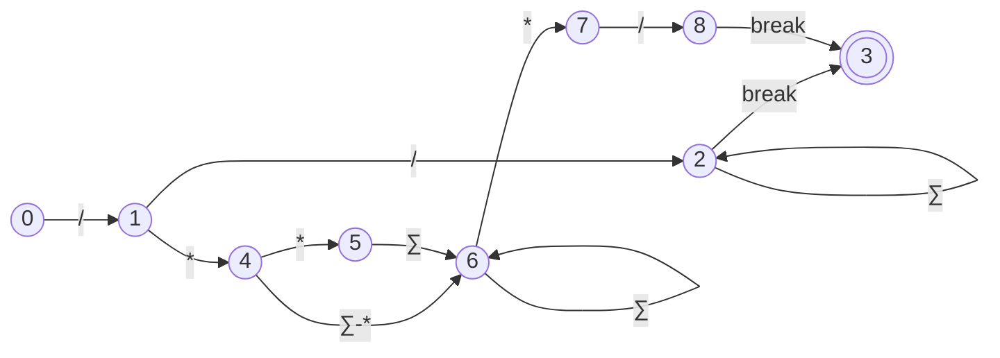

# LAB 1: COMMENTS

## OBJECTIVES

- Understand the purpose and significance of comments in programming.
- Learn the different types of comments (single-line, multi-line, documentation).
- Implement comment tokens in a lexer.
- Develop a C program to determine whether a given string is a valid comment.

## THEORETICAL BACKGROUND

Comments are a crucial component of any programming language. They serve to clarify the code for the reader, enhance readability, and facilitate maintenance. Comments are ignored by the compiler or interpreter, meaning they do not affect the execution of the program. There are three primary types of comments:

1. **Single-line comments**: These comments occupy a single line and typically begin with a specific symbol or sequence of symbols (e.g., `//`, `#`). Everything following this symbol on that line is treated as a comment.

2. **Multi-line comments**: These comments can span multiple lines and are usually enclosed between a pair of delimiters (e.g., `/* ... */`). Everything between these delimiters is considered a comment.

3. **Documentation comments**: These comments are specifically used for generating documentation. They often have a distinct syntax (e.g., starting with `/**` and ending with `*/`) and are used to describe the code in a way that can be extracted into documentation.

### Example Syntax for Various Languages

- **C/C++/Java**:
  - Single-line: `// This is a comment`
  - Multi-line: `/* This is a multi-line comment */`
  - Documentation: `/** This is a documentation comment */`

- **Python**:
  - Single-line: `# This is a comment`
  - Multi-line: `''' This is a multi-line comment '''` or `""" This is a multi-line comment """`

- **JavaScript**:
  - Single-line: `// This is a comment`
  - Multi-line: `/* This is a multi-line comment */`
  - Documentation: `/** This is a documentation comment */`

## IMPLEMENTATION

To implement the recognition of comments in a lexer, we will use the following approach:

1. **Single-line comments**: Detect the presence of the single-line comment symbol and consider all subsequent characters on that line as part of the comment.
2. **Multi-line comments**: Detect the start delimiter and end delimiter, considering all characters between them as part of the comment.
3. **Documentation comments**: Detect the start and end delimiters specific to documentation comments, considering all characters between them as part of the comment.

### State Diagram



## OUTPUTS

```shell
gcc -shared -o libcomment_identifier.so -fPIC comment_identifier.c
pytest test_comment_identifier.py
```

## CONCLUSION

In this lab, we explored the importance of comments in programming and the different types of comments. We also implemented comment tokens in a lexer and developed a C program to test whether a given string is a valid comment. This exercise emphasized the significance of comments in making code more understandable and maintainable.

# LAB 2: REGULAR EXPRESSIONS

## OBJECTIVES

## THEORETICAL BACKGROUND

## OUTPUTS

## CONCLUSION

# LAB 3: IDENTIFIER

## OBJECTIVES

## THEORETICAL BACKGROUND

## OUTPUTS

## CONCLUSION

# LAB 4: LEXICAL ANALYZER

## OBJECTIVES

## THEORETICAL BACKGROUND

## OUTPUTS

## CONCLUSION

# LAB 5: FIRST & FOLLOW OF GRAMMAR

## OBJECTIVES

## THEORETICAL BACKGROUND

## OUTPUTS

## CONCLUSION

# LAB 6: LL(1) PARSER & PARSING TABLE

## OBJECTIVES

## THEORETICAL BACKGROUND

## OUTPUTS

## CONCLUSION

# LAB 7: SHIFT-REDUCE PARSER

## OBJECTIVES

## THEORETICAL BACKGROUND

## OUTPUTS

## CONCLUSION

# LAB 8: IMMEDIATE CODE GENERATOR

## OBJECTIVES

## THEORETICAL BACKGROUND

## OUTPUTS

## CONCLUSION

# LAB 9: FINAL CODE GENERATOR

## OBJECTIVES

## THEORETICAL BACKGROUND

## OUTPUTS

## CONCLUSION
